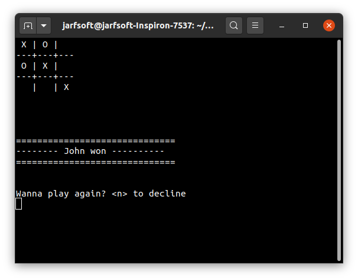

# OOP (Object Oriented Programming)
# Tic Tac Toe Game

# Ruby programmed project that emulates Tic Tac Toe Game for educational purposes

## Built With

- Ruby
- Rspec

## Getting started
# In order to run the project locally follow all steps below:
Install git following the instructions available at [Git](https://git-scm.com/downloads)

Clone the repository typing the command below on your preferred terminal

    git clone https://github.com/marcelomaidden/ruby-milestone-setup

After you have cloned the repository, enter the directory typing 
        
    cd OOP-Object-Oriented-Programming

Install ruby following the instructions available at [Ruby](https://www.ruby-lang.org/en/downloads/)

Then run the command below

    ruby bin/main.rb

## Rules for TIC-TAC-TOE

1. This is played on a board that has grid with spaces of 3 x 3.

2. One player is X, the other is O, they take turns marking on an available space with their respctive symbol.

3. To make your move, you should enter a number from 1 to 3 to select the row in which the space you wish to mark is located, followed by any character (such as space, a coma, ect) and then another number for the column.

4. The first player that marks 3 spaces in a row, column or diagonal will win.

5. If the 9 spaces gets occupied and there is no winner yet, the game finish with a draw.

## Testing
- run `rubocop -A` to find linter errors and fix them
- run `rspec` in the root directory to run spec tests

## Live Demo

[Live Demo Link](https://repl.it/@JuanAndrsAndrs7/WhirlwindRoyalblueConfig#main.rb)

## Author

**Juan Raudales**

- GitHub: [@Jarfsoft](https://github.com/Jarfsoft)
- Twitter: [@Jarfsoft](https://twitter.com/Jarfsoft)
- LinkedIn: [Juan Andres Raudales Flores](https://www.linkedin.com/in/juan-raudales-flores-7b0a3b113/)

👤 **K**

- GitHub: [@harshdeepkanhai](https://github.com/harshdeepkanhai)
- Twitter: [@harshdeepkanhai](https://twitter.com/harshdeepkanhai)
- LinkedIn: [harshdeepkanhai](https://linkedin.com/in/harshdeepkanhai)

## Acknowledgements
- Ruby creators

##  Contributing

Contributions, issues, and feature requests are welcome!

## Show your support

Give a ⭐️ if you like this project!